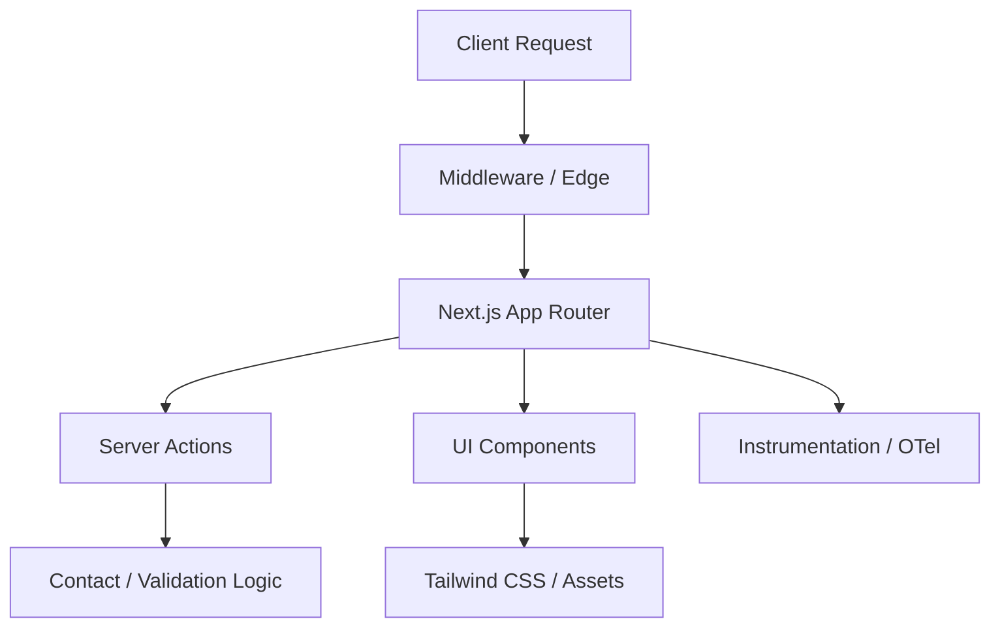
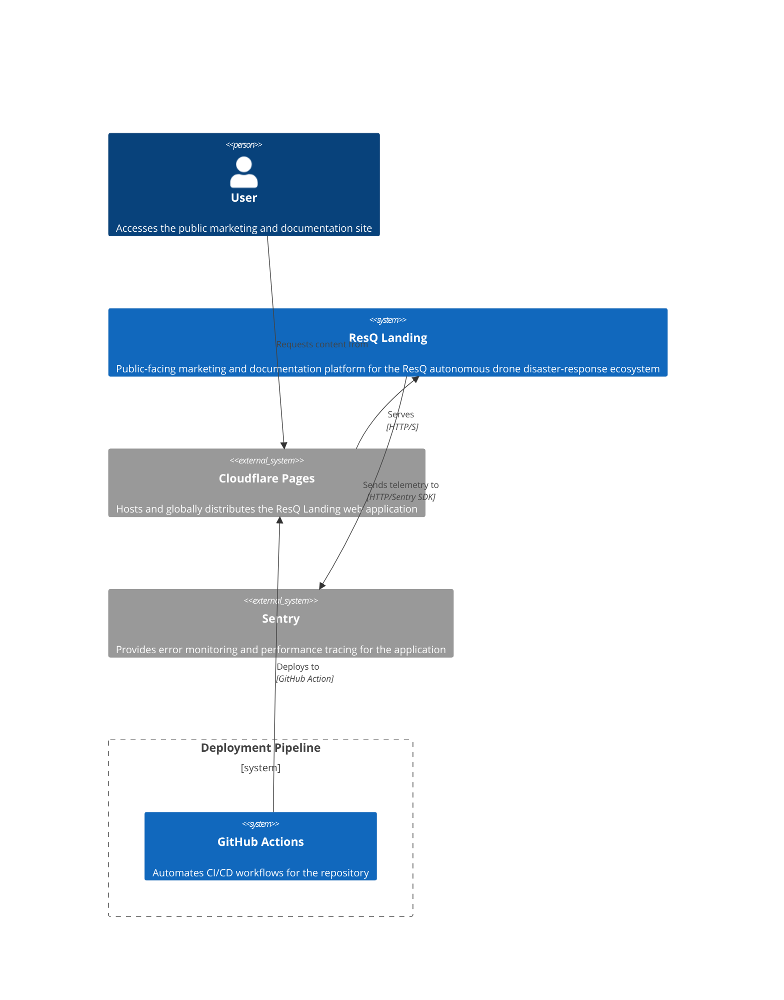

# ResQ Landing

The public-facing marketing and documentation platform for the ResQ autonomous drone disaster-response ecosystem.


---

## Overview

The ResQ Landing repository serves as the public-facing marketing and documentation platform for the ResQ autonomous drone disaster-response ecosystem. Built for speed, accessibility, and high performance, it utilizes the modern Next.js 15 App Router and is optimized for edge-first delivery.

---

## Features

-   **Next.js 15 App Router:** Leverages Server Components for zero-bundle-size static pages.
-   **Tailwind CSS v4:** High-performance, low-configuration utility-first styling.
-   **Edge-Ready:** Instrumented for observability and edge-deployment (Cloudflare/Vercel).
-   **Type-Safe:** Strict TypeScript configuration with Biome linting and formatting.
-   **Robust UI:** Built on top of a shared component library with accessible, adaptive design.
-   **Developer Experience:** Integrated Git hooks, automated agent syncing, and a standardized CLI command structure.

---

## Architecture

The system follows a feature-based architecture where business logic and marketing sections are decoupled from base UI components.

### Request Lifecycle

The diagram below illustrates the flow of a typical web request through the ResQ Landing application, from the edge to UI rendering.



### System Context

ResQ Landing integrates with external services for hosting, content delivery, and observability.



### Component Hierarchy

The codebase is organized with a clear separation of concerns to enhance maintainability and scalability:
-   **`src/app/`**: Contains Next.js App Router pages, layouts, and route handlers. This forms the primary routing and content delivery layer.
-   **`src/components/`**: Houses shared, reusable UI components, often based on [shadcn/ui](https://ui.shadcn.com/) primitives. These components are agnostic to specific business features.
-   **`src/features/`**: Groups components and logic related to specific marketing features or sections, such as `marketing/sections`. This ensures feature-based encapsulation.
-   **`src/actions/`**: Dedicated to Next.js Server Actions, handling server-side data mutations and form submissions.
-   **`src/lib/`**: Provides utility functions and shared helpers used across the application.
-   **`src/config/`**: Stores site-wide constants and environment configuration.
-   **`src/styles/`**: Manages global CSS and Tailwind configuration.
-   **`public/`**: Contains static assets like images, fonts, and icons.

---

## Installation

### Prerequisites
-   [Bun](https://bun.sh/) (runtime and package manager)
-   [Nix](https://nixos.org/) (recommended for reproducible environments)

### Project Setup

```bash
git clone https://github.com/resq-software/landing.git
cd landing
./scripts/setup.sh
```

This script handles installing necessary tools like Nix and Bun, and prepares the project environment.

---

## Quick Start

1.  **Clone the repository:**
    ```bash
    git clone https://github.com/resq-software/landing.git
    cd landing
    ```

2.  **Set up the development environment:**
    The `scripts/setup.sh` script installs prerequisites like Nix and Bun if not present. It also configures Git hooks for an enhanced developer experience.
    ```bash
    ./scripts/setup.sh
    ```

3.  **Install dependencies:**
    Use Bun to install project dependencies.
    ```bash
    bun install
    ```

4.  **Start the development server:**
    Run the application locally.
    ```bash
    bun dev
    ```
    The application will be available at `http://localhost:3000`.

---

## Usage

ResQ Landing is a public-facing website designed for marketing and documentation. Navigation is intuitive, and interactions primarily involve form submissions.

### Site Navigation

A persistent navigation bar appears at the top of the page, adapting to mobile views with a hamburger menu. The main sections include:

-   **Home**: The primary landing page introducing the ResQ platform.
-   **Features**: A detailed overview of the platform's core capabilities.
-   **Use Cases**: Illustrations of various deployment scenarios for the autonomous drone system.
-   **About**: Information regarding the project's mission, architecture, and development philosophy.
-   **Contact**: A form for requesting early access or support.

### Form Submissions

Interactive forms on the site, such as the contact form (`src/app/(marketing)/contact/page.tsx`), use Next.js Server Actions for secure and type-safe data handling.
Input validation is performed on the server using [Zod](https://zod.dev/) schemas.

```typescript
// Example from src/features/marketing/sections/contact-form.tsx
const formAction = useAction(serverAction, {
  onSuccess: () => {
    // Logic for successful form submission, e.g., display a success message
    form.reset();
  },
  onError: (error) => {
    // Handle errors, e.g., display an error message
    console.error("Form submission failed:", error);
  },
});
```

---

## Configuration

Environment variables are managed via `@t3-oss/env-nextjs` for type-safe access and validation. Create a `.env.local` file in the project root based on the `.env.example` file.

| Variable                | Requirement | Description                                                                 |
| :---------------------- | :---------- | :-------------------------------------------------------------------------- |
| `NODE_ENV`              | Required    | Application environment (`development`, `production`).                     |
| `NEXT_PUBLIC_APP_URL`   | Optional    | The canonical URL of the deployed application.                              |
| `NEXT_PUBLIC_SENTRY_DSN`| Optional    | Sentry DSN for client-side error monitoring.                                |
| `SENTRY_AUTH_TOKEN`     | Optional    | Sentry auth token for build-time source map uploads.                        |
| `SENTRY_ORG`            | Optional    | Sentry organization slug.                                                   |
| `SENTRY_PROJECT`        | Optional    | Sentry project slug.                                                        |
| `VERCEL_GIT_COMMIT_SHA` | Optional    | Git commit SHA, used for Sentry release tracking.                           |

---

## API Reference

ResQ Landing leverages Next.js Server Actions for server-side logic and data processing, primarily for form submissions. There is no public REST API for direct client consumption.

### Server Actions

Server Actions are asynchronous functions executed directly on the server, enhancing security and developer experience by eliminating the need for explicit API endpoints. They integrate with React's component model and can be called directly from client components or forms.

-   **`src/actions/contact/submit-contact.ts`**:
    *   **Purpose**: Handles submissions from the marketing contact form.
    *   **Validation**: Uses `contactFormSchema` (defined in `src/lib/validation/form-schema.ts`) for robust input validation with Zod.
    *   **Behavior**: Processes the incoming contact request payload. Currently, it simulates a successful submission after a 1-second delay, logging the request to the console.
    *   **Usage Example (from a client component):**
        ```typescript
        // In a client component, e.g., src/features/marketing/sections/contact-form.tsx
        import { useAction } from "next-safe-action/hooks";
        import { serverAction as submitContactAction } from "@/actions/contact/submit-contact";

        // ... inside a React component
        const { execute, status } = useAction(submitContactAction, {
          onSuccess: (data) => console.log("Success:", data.message),
          onError: (error) => console.error("Error:", error.serverError),
        });

        const onSubmit = (formData) => {
          execute(formData); // Calls the server action with validated data
        };
        ```
    *   The `actionClient` (from `src/actions/shared/safe-action.ts`) wraps server actions, providing type safety and robust error handling.

---

## Development

### Linting and Formatting

This project uses [Biome](https://biomejs.dev/) for consistent code quality and style.

-   **Check linting:**
    ```bash
    bun run lint
    ```

-   **Format and lint code:**
    ```bash
    bun run check
    ```
    This command automatically formats files and applies lint fixes.

### Git Hooks

Pre-commit and pre-push hooks are located in `.git-hooks/`. These hooks enforce code quality standards, prevent large files or secrets from being committed, and ensure commit message compliance. The `scripts/setup.sh` script automatically configures Git to use these hooks.

### Testing

Unit and integration tests are managed by Vitest. Run tests with coverage:

```bash
bun test --coverage
```

### Architectural Decisions (ADRs)

Architectural Decision Records (ADRs) document significant architectural choices and their rationale. This project follows an ADR process to ensure transparency, context, and traceability for important technical decisions.

ADRs for this project are typically stored in a `docs/adr/` directory (if created) within the repository. Each ADR is a short, immutable document describing a decision, its context, considered options, and the chosen solution.

### Component Hierarchy Documentation

The project employs a clear component hierarchy to manage complexity and promote reusability:
-   **`src/app/`**: Route-level components (`page.tsx`, `layout.tsx`). These orchestrate content for specific URLs.
-   **`src/features/`**: Feature-scoped components. For instance, marketing sections (`src/features/marketing/sections/`) like `Hero.tsx` or `ContactForm.tsx` encapsulate logic and UI pertinent to a specific feature.
-   **`src/components/`**: General-purpose UI components (`ThemeProvider.tsx`).
-   **`src/components/ui/`**: Primitives like `button.tsx`, `input.tsx`, `card.tsx`, often generated from [shadcn/ui](https://ui.shadcn.com/) and styled with Tailwind CSS v4. These are highly reusable and independent of business logic.

This structure allows developers to quickly locate and understand code related to specific functionalities or UI elements.

---

## Deployment

The application is deployed automatically to Cloudflare Pages via a CI/CD pipeline configured in `.github/workflows/deploy.yml`.

-   **Continuous Integration (CI) Pipeline**: Every push to `main` or new pull request triggers a build (`bun build`) and type checks to ensure code integrity and prevent regressions.
-   **Continuous Deployment (CD)**: Merges to `main` trigger a new build and deployment to Cloudflare Pages. This process leverages `wrangler-action` to publish the Next.js application, optimized for Cloudflare's edge network.

---

## Contributing

1.  **Fork the repository** and create a new branch for your changes. Follow conventional commit naming: `feat/`, `fix/`, `docs/`, etc.
2.  **Code Quality:** Ensure all code is formatted and linted using `bun run check`.
3.  **Commit Messages:** Adhere to the [Conventional Commits](https://www.conventionalcommits.org/) specification. The `prepare-commit-msg` hook will prefix messages with ticket references if found in the branch name.
4.  **Pull Requests:** Submit pull requests against the `main` branch. Ensure all CI checks pass.

---

## License

This project is licensed under the **Apache License 2.0**. See the [LICENSE](LICENSE) file for details.