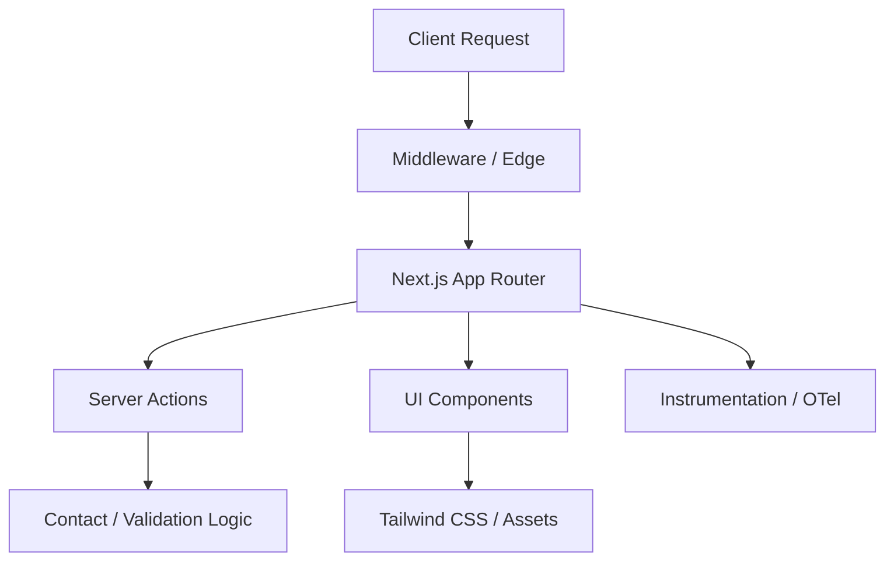

# ResQ Landing

The public-facing marketing and documentation platform for the ResQ autonomous drone disaster-response ecosystem.


---

## Overview

The ResQ Landing repository serves as the public-facing marketing and documentation platform for the ResQ autonomous drone disaster-response ecosystem. Built for speed, accessibility, and high performance, it utilizes the modern Next.js 15 App Router and is optimized for edge-first delivery.

---

## Features

- **Next.js 15 App Router:** Leveraging Server Components for zero-bundle-size static pages.
- **Tailwind CSS v4:** High-performance, low-configuration utility-first styling.
- **Edge-Ready:** Instrumented for observability and edge-deployment (Cloudflare/Vercel).
- **Type-Safe:** Strict TypeScript configuration with Biome linting and formatting.
- **Robust UI:** Built on top of a shared component library with accessible, adaptive design.
- **Developer Experience:** Integrated Git hooks, automated agent syncing, and a standardized CLI command structure.

---

## Architecture

The system follows a feature-based architecture where business logic and marketing sections are decoupled from base UI components.



---

## Installation

### Prerequisites
- [Bun](https://bun.sh/) (runtime and package manager)
- [Nix](https://nixos.org/) (recommended for reproducible environments)

### Project Setup

```bash
git clone https://github.com/resq-software/landing.git
cd landing
./scripts/setup.sh
```

This script handles installing necessary tools like Nix and Bun, and prepares the project environment.

---

## Quick Start

1.  **Clone the repository:**
    ```bash
    git clone https://github.com/resq-software/landing.git
    cd landing
    ```

2.  **Set up the development environment:**
    The `scripts/setup.sh` script will guide you through installing prerequisites like Nix and Bun if they are not already present. It also configures Git hooks for a better developer experience.
    ```bash
    ./scripts/setup.sh
    ```

3.  **Install dependencies:**
    Use Bun to install project dependencies.
    ```bash
    bun install
    ```

4.  **Start the development server:**
    Run the application locally.
    ```bash
    bun dev
    ```
    The application will be available at `http://localhost:3000`.

---

## Usage

### Navigation

The site uses a persistent navigation bar at the top, which adapts for mobile with a hamburger menu. Key sections include:

-   **Home:** The main landing page.
-   **Features:** Details the platform's capabilities.
-   **Use Cases:** Illustrates deployment scenarios.
-   **About:** Provides company and product philosophy information.
-   **Contact:** For requesting early access or support.

### Form Submissions

Forms, such as the contact form, utilize Next.js Server Actions for secure and type-safe data handling. Input validation is performed using Zod.

---

## Configuration

Environment variables are managed via `@t3-oss/env-nextjs`. Create a `.env.local` file in the project root based on the `.env.example` file.

| Variable                | Requirement | Description                                                                 |
| :---------------------- | :---------- | :-------------------------------------------------------------------------- |
| `NODE_ENV`              | Required    | Application environment (`development`, `production`).                     |
| `NEXT_PUBLIC_APP_URL`   | Optional    | The canonical URL of the deployed application.                              |
| `NEXT_PUBLIC_SENTRY_DSN`| Optional    | Sentry DSN for client-side error monitoring.                                |
| `SENTRY_AUTH_TOKEN`     | Optional    | Sentry auth token for build-time source map uploads.                        |
| `SENTRY_ORG`            | Optional    | Sentry organization slug.                                                   |
| `SENTRY_PROJECT`        | Optional    | Sentry project slug.                                                        |
| `VERCEL_GIT_COMMIT_SHA` | Optional    | Git commit SHA, used for Sentry release tracking.                           |

---

## API Overview

The project primarily uses Next.js Server Actions for backend interactions, such as form submissions.

### Server Actions

-   **`src/actions/contact/submit-contact.ts`**: Handles contact form submissions. It validates data using Zod and simulates a successful request.

---

## Development

### Linting and Formatting

This project uses [Biome](https://biomejs.dev/) for code linting and formatting to ensure consistent code quality.

-   **Check linting:**
    ```bash
    bun run lint
    ```

-   **Format and lint code:**
    ```bash
    bun run check
    ```
    This command automatically formats files and applies lint fixes.

### Git Hooks

Pre-commit and pre-push hooks are located in `.git-hooks/`. These hooks enforce code quality standards, prevent large files or secrets from being committed, and ensure commit message compliance. The `scripts/setup.sh` script automatically configures Git to use these hooks.

### Testing

Unit and integration tests are managed by Vitest. Run tests with coverage:

```bash
bun test --coverage
```

### Deployment

The application is deployed automatically to Cloudflare Pages via a CI/CD pipeline configured in `.github/workflows/deploy.yml`.

-   **CI Pipeline:** Runs `bun build` and type checks on every push to `main` or pull request.
-   **Deployment:** Merges to `main` trigger a build and deployment to Cloudflare Pages using `wrangler-action`.

---

## Contributing

1.  **Fork the repository** and create a new branch for your changes. Follow conventional commit naming: `feat/`, `fix/`, `docs/`, etc.
2.  **Code Quality:** Ensure all code is formatted and linted using `bun run check`.
3.  **Commit Messages:** Adhere to the [Conventional Commits](https://www.conventionalcommits.org/) specification. The `prepare-commit-msg` hook will prefix messages with ticket references if found in the branch name.
4.  **Pull Requests:** Submit pull requests against the `main` branch. Ensure all CI checks pass.

---

## Roadmap

-   [ ] Implement dark/light mode toggle with system preference persistence.
-   [ ] Add comprehensive E2E tests using Playwright.
-   [ ] Extend instrumentation to include custom performance metrics.
-   [ ] Add blog functionality using MDX.

---

## License

This project is licensed under the **Apache License 2.0**. See the [LICENSE](LICENSE) file for details.