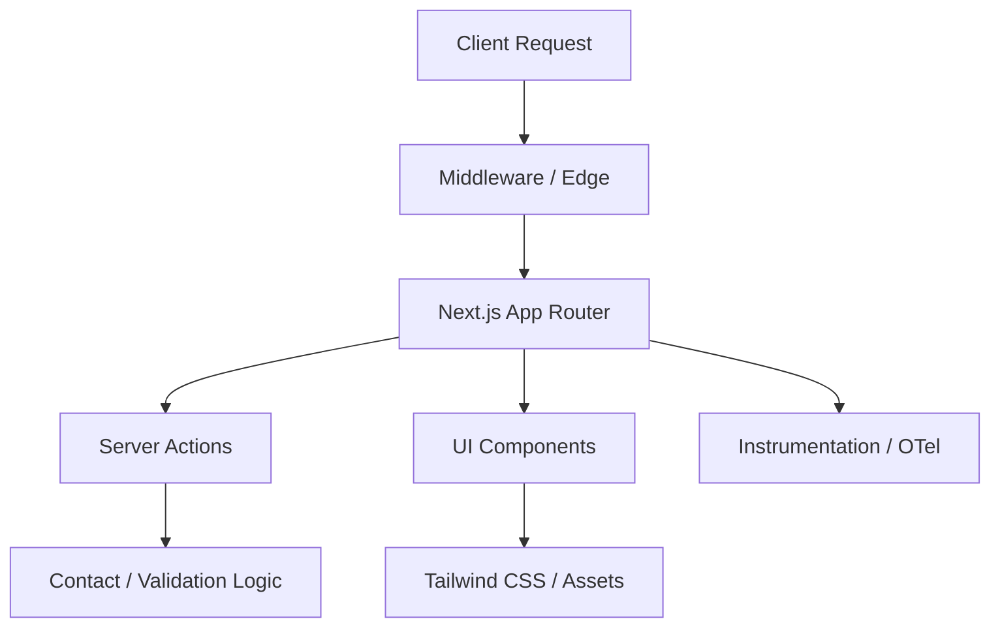

# ResQ Landing Documentation


## Table of Contents
1. [Overview](#overview)
2. [Features](#features)
3. [Architecture](#architecture)
4. [Quick Start](#quick-start)
5. [Usage](#usage)
6. [Configuration](#configuration)
7. [API Overview](#api-overview)
8. [Development](#development)
9. [Contributing](#contributing)
10. [Roadmap](#roadmap)
11. [License](#license)

---

## Overview

The ResQ Landing repository serves as the public-facing marketing and documentation platform for the ResQ autonomous drone disaster-response ecosystem. Built for speed, accessibility, and high performance, it utilizes the modern Next.js 15 App Router and is optimized for edge-first delivery.

---

## Features

- **Next.js 15 App Router:** Leveraging Server Components for zero-bundle-size static pages.
- **Tailwind CSS v4:** High-performance, low-configuration utility-first styling.
- **Edge-Ready:** Instrumented for observability and edge-deployment (Cloudflare/Vercel).
- **Type-Safe:** Strict TypeScript configuration with Biome linting and formatting.
- **Robust UI:** Built on top of a shared component library with accessible, adaptive design.
- **Developer Experience:** Integrated Git hooks, automated agent syncing, and a standardized CLI command structure.

---

## Architecture

The system follows a feature-based architecture where business logic and marketing sections are decoupled from base UI components.



---

## Quick Start

### Prerequisites
- [Bun](https://bun.sh/) (runtime and package manager)
- [Nix](https://nixos.org/) (recommended for reproducible environments)

### Installation
```bash
git clone https://github.com/resq-software/landing.git
cd landing
./scripts/setup.sh
bun install
```

### Running Locally
```bash
bun dev
```
Navigate to `http://localhost:3000` to view the application.

---

## Usage

### Adding a New Page
New marketing pages should be added under the `src/app/(marketing)/` directory to inherit the marketing layout and styles.

### Syncing Agent Documentation
If you modify `AGENTS.md`, ensure you run the sync script to update local agent configurations:
```bash
./agent-sync.sh
```

---

## Configuration

Environment variables are managed via `@t3-oss/env-nextjs`. Create a `.env.local` file from the `.env.example`:

| Variable | Requirement | Description |
| :--- | :--- | :--- |
| `NEXT_PUBLIC_SENTRY_DSN` | Optional | Client-side error monitoring DSN |
| `SENTRY_AUTH_TOKEN` | Required | For build-time source map uploads |
| `VERCEL_TOKEN` | Build-time | Required for automated deployments |

---

## API Overview

The project leverages **Next.js Server Actions** for handling form submissions and server-side state mutations.

### `src/actions/contact/submit-contact.ts`
- **Purpose:** Handles contact form submissions.
- **Validation:** Uses Zod schemas defined in `src/lib/validation/form-schema.ts`.
- **Return Type:** `SafeAction` wrapper ensuring unified response formatting.

---

## Development

### Linting & Formatting
We use [Biome](https://biomejs.dev/) to enforce high-performance code standards.
```bash
bun run lint   # Run linter
bun run check  # Format and lint
```

### Git Hooks
Pre-commit and pre-push hooks are located in `.git-hooks/`. They ensure that code quality standards are maintained before any code reaches the remote repository.

### CI/CD
The repository uses GitHub Actions for CI:
- **CI Pipeline:** Validates builds, checks linting, and runs type-checking.
- **Deployment:** Automatic deployments to Vercel upon merging to the `main` branch.

---

## Contributing

1. **Fork the repo.**
2. **Feature Branch:** Create a branch based on our conventional commit standards (`feat/`, `fix/`, `content/`).
3. **Commit Messages:** Follow [Conventional Commits](https://www.conventionalcommits.org/).
4. **Testing:** Run `bun check` before submitting a Pull Request.

---

## Roadmap

- [ ] Implement dark/light mode toggle with system preference persistence.
- [ ] Add comprehensive E2E tests using Playwright.
- [ ] Extend instrumentation to include custom performance metrics.
- [ ] Add blog functionality using MDX.

---

## License

Copyright 2026 ResQ. Licensed under the [Apache License, Version 2.0](./LICENSE).